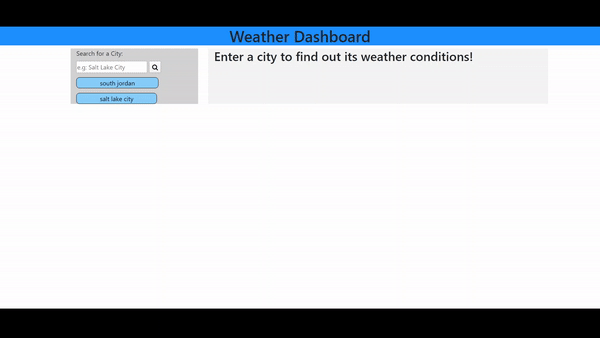

# WeatherApp

# Link (https://ericcwong.github.io/WeatherApp/)

# Demo
 
This is a weather checker for the desired city. Say you want to check what is the current weather in West Jordan, type that into the input section and hit enter. The weather current weather will show up as well as the five day weather. If you want to check the neighboring city say South Jordan. Same as before, you would have just input it into the input box and hit enter. Then it will switch to South Jordan. Then you can have the option to bounce back to West Jordan with the click of the button that is created once you hit previously. Now you have a way to check the weather few clicks and typing! All the searched city is saved into the local storage so that means if you leave the page or refresh it, the searched city buttons will still be there.

# Resources
<ul>
  <li>Erik Huynh (Classmate)</li>
    
Erik helped me with the button to save and recall the information for local storage. He went above and beyond to help me solve the problem. 

  <li>W3Schools.com</li>
  <li>Jquery.com</li>
  <li>Youtube videos on localStorage</li>
  
  # Improvements on this weather app
  A way to improve this weather app is to have to it pull the time that is relevant to the user's current time. Right now it pulls the a hard coded time of 12:00 P.M. Styling will need some touch up so it doesn't look like a early 2000 website. 
  
  # Usage
  Code is free to use, change it up then it wouldn't be exact.
